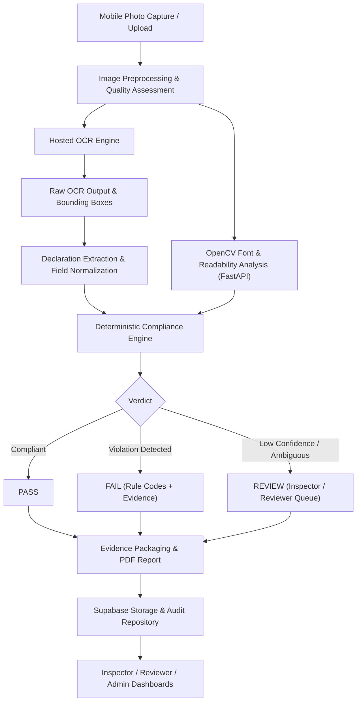

# PS26034 Master Project Rules

This skill provides the overarching rules, architectural principles, and operational boundaries for **SIH Problem Statement 26034: Software System for Legal Metrology Compliance of Packaged Commodities**.

---

## 1. Core Principles & Non-Negotiable Rules

1. **Workspace Context**: This workspace is dedicated to SIH PS26034. Every module, route, and utility must serve the goal of verifying packaged commodity compliance under Indian Legal Metrology rules.
2. **Standard Architecture**: Follow the defined PS26034 architecture:
   - **Frontend**: Next.js (App Router), TypeScript, Tailwind CSS, shadcn/ui. Mobile-first design for field inspectors.
   - **Backend / APIs**: Next.js API routes for standard business logic and data persistence.
   - **Computer Vision / Font Analysis**: Python + OpenCV + FastAPI service exclusively where native image geometry, character pixel height, and contours are processed.
   - **Database, Auth & Storage**: Supabase Postgres (with RLS), Supabase Auth (RBAC), and Supabase Storage (private buckets for raw packaging images, crops, and reports).
   - **OCR Layer**: Hosted OCR API with robust image preprocessing and raw OCR text preservation.
   - **Reporting**: PDF report generation using `@react-pdf/renderer` or `pdf-lib`.
3. **Prefer TypeScript End-to-End**: Use TypeScript for frontend, API routes, data validation, and the compliance engine. Use Python/FastAPI only where Python/OpenCV is genuinely required.
4. **Deterministic Compliance Engine**:
   > [!CRITICAL]
   > **THE LLM IS NOT THE LEGAL COMPLIANCE AUTHORITY.**
   > All final compliance verdicts (**PASS / FAIL / REVIEW**) must be computed deterministically by versioned, auditable rule evaluation functions.
5. **Role of Generative AI / LLMs**: LLMs are bounded assistants. They may normalize noisy OCR text, suggest declaration field mappings, explain deterministic violations, and summarize inspection reports. They must **never** make final compliance decisions, override rules, or invent requirements.
6. **Evidence-Backed Violations**: Every `FAIL` verdict must be backed by concrete evidence (image reference, bounding box, observed value vs. expected threshold).
7. **Rule Code Traceability**: Every compliance check, failure, and warning must reference an explicit `rule_code` (e.g., `LM-MRP-001`, `LM-NET-QTY-002`, `LM-FONT-003`).
8. **Conservative REVIEW Status**: Use `REVIEW` whenever OCR confidence is below threshold, image quality is degraded, computer vision measurement is ambiguous, or evidence is incomplete. Never guess.
9. **Preserve Auditability**: Every inspection, review action, rule change, and report generation must produce an immutable audit log entry.
10. **Protect Evidence & Reports**: Store packaging label images and generated PDF reports in secure, private storage buckets. Access must be mediated via authenticated, signed, short-lived URLs.
11. **Role-Based Access Control (RBAC)**: Enforce strict role separation:
    - **Inspector**: Upload label photos, review extractions, inspect results, view reports.
    - **Reviewer**: Monitor flagged review queue, audit violations, annotate inspections.
    - **Admin**: Configure regulatory rulesets, manage system users, view system-wide analytics.
12. **Mobile-First for Inspectors**: Prioritize field usability on handheld smartphones (large touch targets, camera integration, low-bandwidth resilience, high-contrast badges).
13. **Playwright E2E Verification**: Validate critical user journeys with automated Playwright tests (login, upload, OCR extraction, compliance evaluation, report download).
14. **Up-to-Date Official Documentation**: Query official documentation via Context7 or search tools when integrating dependencies.
15. **Supabase Database Management**: Use Supabase CLI and migrations for database schema changes.
16. **No Destructive Database Changes Without Review**: Always inspect existing schemas and assess migration impact before applying alterations.
17. **Never Invent Legal Requirements**: All compliance rules must derive directly from the Legal Metrology (Packaged Commodities) Rules, 2011 (and applicable amendments).
18. **No Fabricated Evidence**: Never fabricate test data or demo evidence. Clearly flag demo fixtures and mock datasets as `[DEMO / TEST FIXTURE]`.
19. **Inspect Before Changing**: Always view existing code and test suites before introducing modifications.
20. **Minimal, Maintainable Changes**: Write clean, modular, typed, and well-tested code. Avoid redundant dependencies or unnecessary abstractions.

---

## 2. End-to-End System Pipeline

---

## 3. Skill Catalog & Subsystem Mapping

When working on specific subsystems of PS26034, consult the specialized skills:

| Code | Skill Folder | Subsystem Focus |
|---|---|---|
| **01** | `01-ps26034-project-architect` | Full-stack architecture, API boundaries, service contracts |
| **02** | `02-legal-metrology-compliance-domain` | Legal Metrology rules, mandatory fields, entities, roles |
| **03** | `03-ocr-label-extraction` | Preprocessing, OCR invocation, raw text retention, field mapping |
| **04** | `04-font-readability-opencv` | Python/OpenCV text region detection, character pixel height |
| **05** | `05-deterministic-compliance-engine` | Final verdict engine, rule evaluation, boundary tests |
| **06** | `06-evidence-audit-reporting` | Reconstructable audits, evidence bounding boxes, PDF generation |
| **07** | `07-supabase-security-rls` | PostgreSQL schemas, RLS policies, RBAC, signed storage |
| **08** | `08-mobile-inspector-ui` | Mobile-first UI, camera capture, inspection flows, dashboards |
| **09** | `09-playwright-e2e-testing` | Playwright test suites, role-based workflows, error scenarios |
| **10** | `10-ai-rule-auditor` | Bounded LLM assistant for normalization, explanations, summaries |
| **11** | `11-sih-demo-judge-readiness` | SIH golden demo script, pitch narrative, judge FAQ readiness |
| **12** | `12-code-quality-security` | TypeScript strictness, input sanitization, OWASP, code review |
